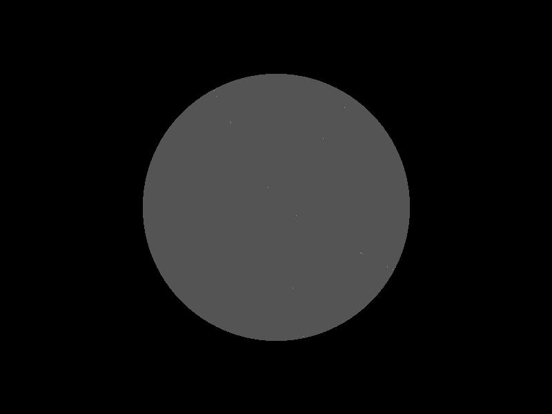
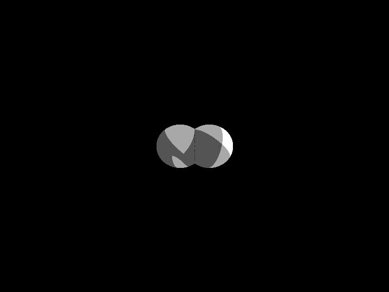
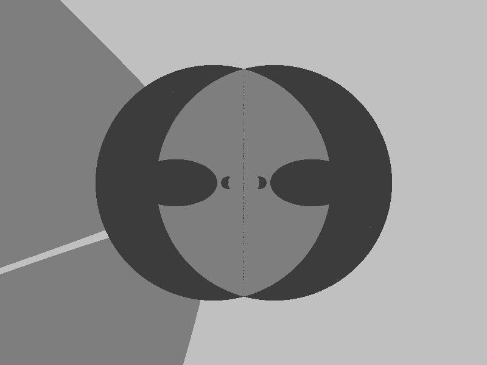
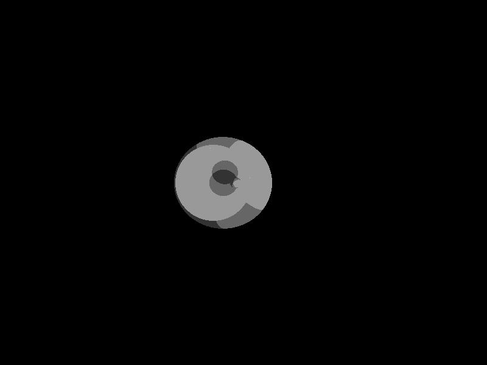
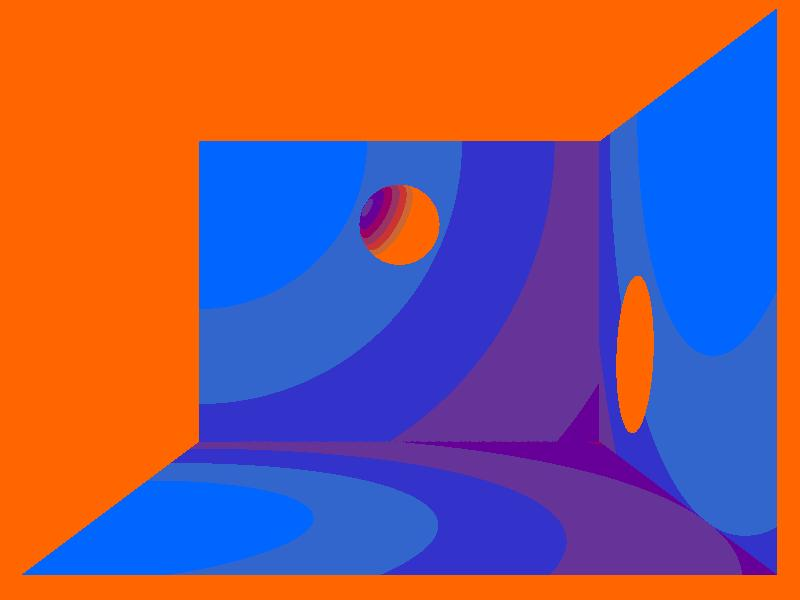
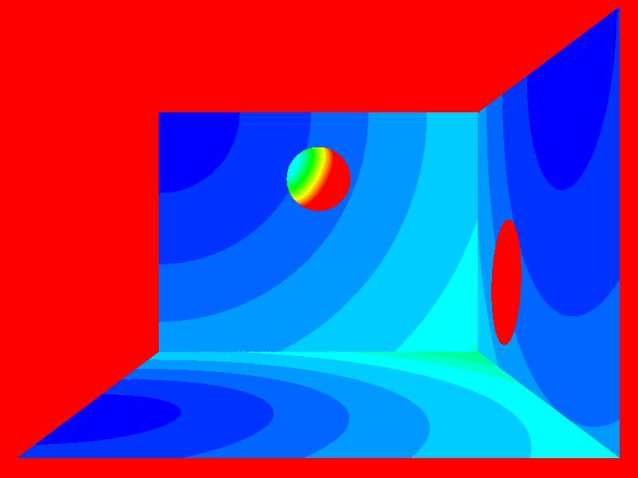

# In progress

- [X] Implemented Vectors, lines, parametric lines, lightsources, and other utility classes
- [X] Implemented object oriented intersection algorithms for spheres and rectangles
- [X] Implemented object oriented ray trace algorithm that handles intersecting shapes, and viewport-shape intersections nicely
- [X] Implemented lambertian shader
- [X] Can write images to jpg format
- [X] Can choose color palletes when writing to jpg
- [X] Can render to a gui with openGL, en set up gui for moving through the scene
- [ ] wrote unit tests for the object composing the object oriented implementation
- [ ] Implemented a openCL/ GPU compatible version of the ray tracing algorithm using primitives and one-dimensional arrays
- [ ] wrote unit tests for the GPU kernel algorithm
- [ ] Handle user input to move through the scene

## Gray scale examples

### Viewpoint is inside a sphere, there is another sphere you cannot see due to lighting

### Two spheres in front of the viewer that intersect

### pumpkin, viewer is inside big sphere, looking inside two intersecting spheres from the outside, seeing two little spheres

### Looking inside a sphere from the outside, there is a sphere and lightsources inside

## Pseudocolor example

## rainbow example

